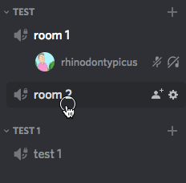

# DiscoBots: Voice Channels Autosizer

Automatic adjustments of Discord voice channels count in category and make sure that at least one empty channel exists.



## Usage

Install:

```
npm install
cp .env.example .env
```

Fill channels ids in `config.json` and discord bot token in `.env`.

Run app.

## License
The MIT License (MIT). Please see [License File](LICENSE.md) for more information.
